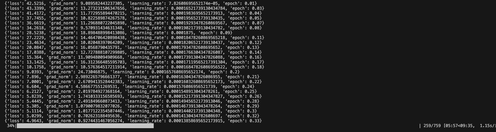

# AI-Driven Fault Analysis and Operational Optimization in Power Systems

## Overview
This project investigates how Large Language Models (LLMs) can turn unstructured power system data (shift notes, alarm logs, maintenance reports) into insights. By fine-tuning a transformer-based LLM (e.g., FLAN-T5 or LLaMA-2) with domain data, the system enables:

- Fault classification
- Trend/frequency analysis
- Actionable recommendation generation
- Insight dashboards for operators

## Repository Structure
- src/fault_analysis: Core library (data schema, loaders, preprocessing, training, analysis)
- data: Raw, processed and sample datasets
- configs: Configurations for experiments
- scripts: CLI entrypoints
- app: Streamlit dashboard
- notebooks: Research notebooks

## Quickstart with Docker (Recommended)

### Prerequisites
- Docker and Docker Compose installed
- At least 8GB RAM available for training

### Step 1: Prepare Your Data

If you have CSV data, convert it to JSONL format:

```bash
# Convert CSV to instruction-format JSONL
docker-compose run --rm fault-analysis python scripts/convert_csv_to_jsonl.py \
  --csv-path data/samples/fault_data.csv \
  --output-path data/samples/fault_data_instruction.jsonl \
  --schema instruction
```

This creates training data in the required format with fields: `id`, `instruction`, `input`, `output`, `tags`, `metadata`.

### Step 2: Configure Training

Review and adjust the training configuration:

```bash
cat configs/config.example.yaml
```

Key settings:
- `train_path`: Path to your JSONL training data
- `model_name`: Base model (e.g., `google/flan-t5-small` or `google/flan-t5-base`)
- `num_train_epochs`: Number of training epochs
- `per_device_train_batch_size`: Batch size (reduce if out of memory)

### Step 3: Train the Model

Run training using Docker:

```bash
docker-compose --profile training run --rm trainer
```

**What to expect during training:**



You'll see:
- Model downloading (first time only)
- Data preprocessing
- Training progress with loss values and learning rate
- Steps like: `{'loss': 1.234, 'grad_norm': 5.678, 'learning_rate': 0.0002, 'epoch': 0.5}`
- Model checkpoints saved to `outputs/flan_t5_lora/`

**Training time:** 15-45 minutes on CPU (depending on dataset size and model)

**Troubleshooting:**
- If you get OOM (Out of Memory) errors, reduce `per_device_train_batch_size` to 1 in the config
- Use `google/flan-t5-small` instead of `flan-t5-base` for lower memory requirements

### Step 4: Run the Dashboard

Start the Streamlit web interface:

```bash
docker-compose up
```

### Step 5: Access the Inference Interface

1. Open your browser and navigate to: **http://localhost:8501**

2. Click on the **🔍 Inference** tab at the top

3. Enter a fault description in the text area, for example:
   ```
   Transformer T3 oil temp reached 95C during evening peak. 
   Cooling fan 2 reported failure.
   ```

4. Click **🔍 Analyze Fault** to get AI-generated analysis and recommendations

5. The model will provide:
   - Fault classification
   - Root cause analysis
   - Corrective actions
   - Preventive recommendations

### Step 6: Explore Your Data (Optional)

Switch to the **📊 Data Explorer** tab to:
- Upload JSONL files
- View data statistics
- Analyze fault type distributions
- Examine label frequencies

## Alternative: Local Installation (Without Docker)

1) Create and activate a virtual environment
```bash
python3 -m venv .venv
source .venv/bin/activate  # macOS/Linux
```

2) Install dependencies
```bash
pip install -r requirements.txt
```

3) Train the model
```bash
python3 scripts/train_lora.py --config configs/config.example.yaml
```

4) Run the dashboard
```bash
streamlit run app/streamlit_app.py
```

## Data Format
JSONL lines. Two supported schemas:
- instruction: {"id", "timestamp", "source", "instruction", "input", "output", "tags", "metadata"}
- fault: {"id", "timestamp", "source", "text", "fault_type", "labels", "recommendations", "metadata"}

Use `src/fault_analysis/data/loader.py` to validate and load.

## Notes
- **Model Selection**: Start with `google/flan-t5-small` (77M params) for faster training and lower memory usage. Upgrade to `flan-t5-base` (248M params) for better performance if you have sufficient resources.
- **Hardware**: GPU recommended for training but not required. CPU training works but is slower (15-45 mins for small datasets).
- **Memory**: Minimum 8GB RAM recommended. If you encounter OOM errors, reduce batch size or use a smaller model.
- **Data Quality**: Better training data = better model. Ensure your JSONL data has clear instructions, inputs, and expected outputs.
- **Hyperparameters**: Adjust LoRA rank (`r`), learning rate, and epochs in `configs/config.example.yaml` based on your dataset size and quality.

## Docker Commands Reference

```bash
# Build/rebuild Docker images
docker-compose build

# Convert CSV to JSONL
docker-compose run --rm fault-analysis python scripts/convert_csv_to_jsonl.py

# Train the model
docker-compose --profile training run --rm trainer

# Run the dashboard
docker-compose up

# Stop the dashboard
docker-compose down

# View logs
docker-compose logs -f
```
